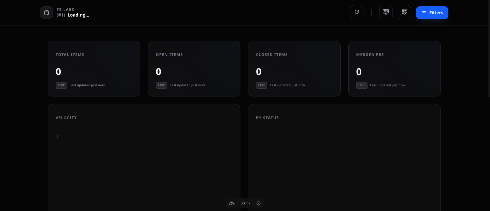

# GitHub Projects v2 Dashboard

[](https://vercel.com/new/clone?repository-url=https%3A%2F%2Fgithub.com%2Ftiagofrancafernandes%2Fgh-projects-stats-nuxt&env=GITHUB_TOKEN,DEFAULT_GITHUB_OWNER,DEFAULT_GITHUB_ORG,DEFAULT_GITHUB_PROJECT)

A professional, high-performance dashboard for visualizing GitHub Projects v2 metrics. Built with Nuxt 4, Tailwind CSS, and Chart.js.

## Key Features

### 🚀 Smart Selection & Discovery
- **Multi-Step Selection Flow**: Seamlessly browse through Organizations, Users, and their Projects v2.
- **Typeahead Search**: Intelligent search across all organizations and projects for lightning-fast navigation.
- **Access Control & Filtering**: Restrict visibility using `ALLOWED_ORGS` or `EXCLUDED_PROJECTS` environment variables for secure, tailored experiences.

### 📊 Advanced Data Visualization
- **Real-time Metrics**: Dynamic aggregate counts for Total Items, Open/Closed states, and Merged Pull Requests.
- **Programmable Metrics (Custom Logic)**: Create cards with custom JavaScript logic to perform complex calculations, data merging, or conditional formatting.
- **Interactive Charts**:
  - **Velocity Charts**: Track items created vs. updated over time.
  - **Status & Label Distribution**: Visual breakdowns of your project's health and organization.
- **Expanded Views**: Click any card or chart to view detailed data in full-screen mode.

### 🛠️ Layout & View Management
- **Dynamic Grid System**: Resize cards (1/4 to 4/4 width) to prioritize the metrics that matter most.
- **Nested Grouping**: Cluster related cards into containers to organize complex dashboards.
- **Drag-and-Drop Reordering**: Intuitive interface to rearrange your layout in seconds.
- **Multiple Saved Views**: Create, clone, and switch between different dashboard configurations (e.g., "Daily Standup", "Monthly Report").
- **Smart Save Workflow**: Non-intrusive floating action button (FAB) for quick updates or "Save As..." new views.

### 📺 High-Performance UX
- **TV / Focus Mode**: A dedicated, distraction-free mode optimized for big screens and ultra-wide monitors.
- **Premium Aesthetics**: A stunning dark-themed, glassmorphic design inspired by modern tools like Linear.
- **Import/Export**: Full portability for your configurations via JSON backups.
- **Responsive Design**: Fully functional across desktop and large-scale displays.

## Tech Stack

- **Framework**: [Nuxt 4](https://nuxt.com/) (Compatibility mode)
- **Styling**: [Tailwind CSS](https://tailwindcss.com/)
- **Icons**: [Iconify](https://iconify.design/)
- **Charts**: [Chart.js](https://www.chartjs.org/) via [vue-chartjs](https://vue-chartjs.org/)
- **State/Hooks**: [@vueuse/nuxt](https://vueuse.org/)

## Screenshots


*Modern, glassmorphic dashboard with real-time metrics.*


*Advanced layout management with card grouping and drag-and-drop.*

## Documentation

Explore our detailed guides in the [docs](./docs/README.md) folder:
- [Programmable Metrics & Custom Logic](./docs/CUSTOM_LOGIC.md)
- [View Management & Cloning](./docs/VIEW_MANAGEMENT.md)
- [Layout & Card Management](./docs/LAYOUT_MANAGEMENT.md)
- [Backup & Portability (Import/Export)](./docs/IMPORT_EXPORT.md)

## Deployment

### Deploy to Vercel

The easiest way to deploy this dashboard is using Vercel. Click the button above to clone and deploy.

**Important**: You must provide the following environment variables during deployment (or add them later and trigger a redeploy):

| `DEFAULT_GITHUB_PROJECT` | Default project number (e.g., `1`). |

### Access Control & Filtering

You can restrict which organizations and projects are visible and accessible in the dashboard using the following environment variables (values are comma-separated):

- **Organizations/Users**:
    - `ALLOWED_ORGS`: Show **only** these organizations or users.
    - `EXCLUDED_ORGS`: Hide these specific organizations or users.
- **Projects**:
    - `ALLOWED_PROJECTS`: Show **only** these project numbers or titles.
    - `EXCLUDED_PROJECTS`: Hide these specific project numbers or titles.

*Note: Access control is enforced at the API level. Even if a user knows the URL, they will be blocked from accessing unauthorized data.*

### Environment Variables (.env)

For local development, create a `.env` file in the root directory:

```env
GITHUB_TOKEN=your_github_pat
DEFAULT_GITHUB_OWNER=usuario-ou-org
DEFAULT_GITHUB_ORG=usuario-ou-org
DEFAULT_GITHUB_PROJECT=1
```

### Installation

```bash
# Install dependencies
npm install

# Start development server
npm run dev

# Build for production
npm run build
```

## Usage

1. **Select Owner**: Type or select a GitHub organization or user.
2. **Select Project**: Choose from the list of available Projects v2.
3. **Explore**: Interact with cards, expand charts, or use the Filters modal to drill down into data.
4. **TV Mode**: Use the "TV Mode" button for a clean, full-screen presentation.

## Architecture

- **Backend**: Nitro server routes (`/api`) fetch data from GitHub's GraphQL API.
- **Caching**: Server-side caching is implemented to avoid GitHub API rate limits.
- **Mapper**: Specialized utility to transform complex GraphQL responses into clean dashboard-ready objects.
- **Components**: Atomic design with reusable `StatCard`, `TypeaheadSelect`, and Chart components.

## License

MIT
