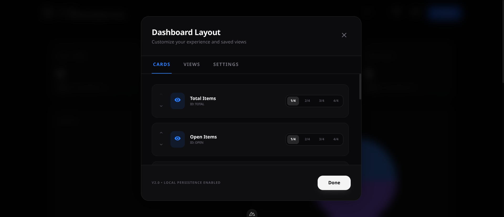
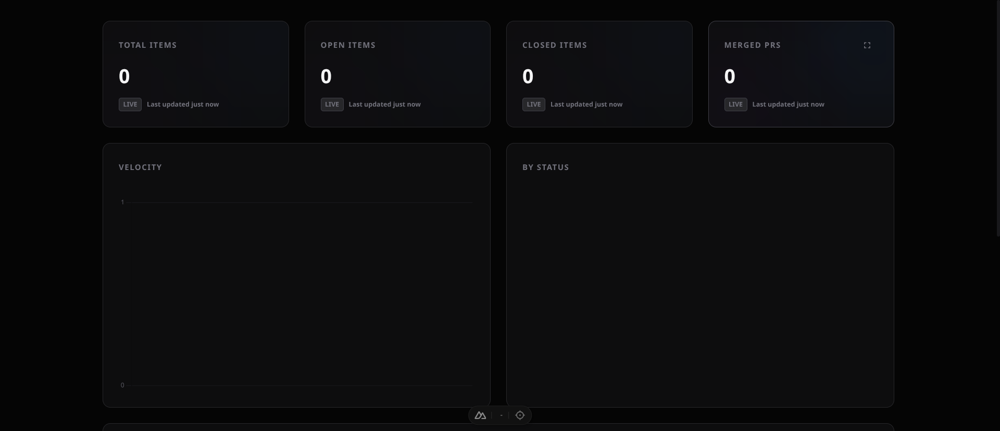

# Layout & Card Management

Organize your dashboard to prioritize the metrics that matter most.

## Layout Manager

Open the Layout Manager from the settings icon in the top right to:
- **Add Cards**: Add new Stats, Gauges, Pie Charts, or Line Charts.
- **Group Containers**: Add "Group" cards to cluster related metrics together.
- **Reorder**: Drag cards using the handle (or use up/down arrows in the manager) to change their position.
- **Visibility**: Toggle cards on and off without deleting them.

## Card Widths

Each card can be set to a width of **1/4, 2/4, 3/4, or 4/4** (full width) of the grid. 
- Use **1/4** for simple stat numbers.
- Use **2/4 or 4/4** for complex charts and activity lists.

## Grouping Stats

Group cards allow you to nest multiple widgets inside a single container. This is perfect for:
- Keeping "Gauge" charts together.
- Organizing metrics by category (e.g., "Velocity", "Quality", "Traffic").
- Managing complex layouts with drag-and-drop.

## TV Mode

For big screen displays, enable **TV Mode** from the top bar. This:
- Expands the dashboard to fill the screen.
- Increases the gap between cards for better legibility.
- Automatically hides non-essential UI elements like the navigation and settings buttons.

