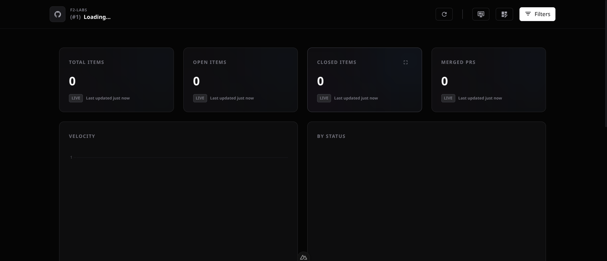

# View Management

The dashboard supports multiple independent views, allowing you to switch between different layouts (e.g., "Developer View", "PM Overview", "TV Display") with a single click.

## The View Selector

Located in the top navigation bar, the View Selector is your command center for managing layouts:
- **Switch Views**: Click on any saved view to load its layout immediately.
- **Search**: Use the typeahead search to find specific views.
- **Duplicate**: Create a copy of an existing view to experiment with changes without affecting the original.
- **Delete**: Remove views you no longer need.

## Saving Changes

The dashboard tracks your changes in real-time. When you modify a layout, a **Floating Action Button (FAB)** will appear in the bottom-right corner.

### Options:
1. **Quick Update**: Click the save icon to instantly update the current view.
2. **Options/Expand**: Open the Save Modal for more choices.
3. **Save As...**: In the Save Modal, you can choose to save your modifications as a brand-new view instead of updating the current one.

## Persistence

All views and configurations are stored in your browser's **Local Storage**. This means your views are specific to your device and browser. 

> [!TIP]
> To share views with colleagues or move them between devices, use the **Export/Import** feature found in the Layout Manager settings.
